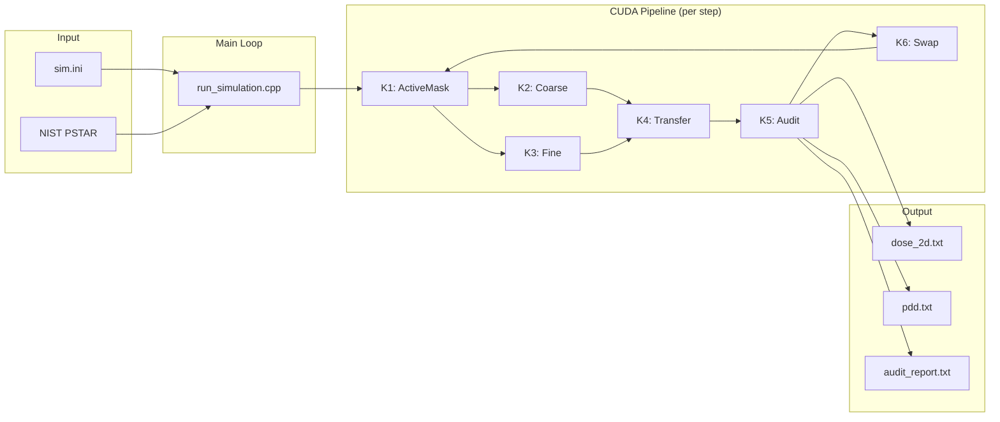

# SM_2D Complete Code Documentation

## Table of Contents

| Section | Description | Link |
|---------|-------------|------|
| **Quick Start** | 5-minute overview | [View](#quick-start) |
| **Architecture** | System design & diagrams | [Link](architecture/01_overview.md) |
| **CUDA Pipeline** | GPU kernel details | [Link](architecture/02_cuda_pipeline.md) |
| **Data Structures** | Core storage formats | [Link](modules/01_core_data_structures.md) |
| **Physics Models** | Physics implementation | [Link](physics/01_physics_models.md) |
| **API Reference** | Complete function reference | [Link](api/01_api_reference.md) |

---

## Quick Start

### What is SM_2D?

SM_2D is a **deterministic proton transport solver** for radiotherapy dose calculation. It uses:
- **GPU acceleration** (CUDA) for clinical-speed calculation
- **Hierarchical S-matrix method** for deterministic transport
- **Comprehensive physics** (Highland MCS, Vavilov straggling, nuclear interactions)
- **Conservation auditing** for numerical accuracy validation

### Project at a Glance

```
Language:        C++17 with CUDA
Lines of Code:   ~20,000 (66 C++ files, 9 CUDA kernels, 5 Python scripts)
GPU Memory:      ~4.3GB per simulation
Accuracy:        Bragg peak <1%, Lateral spread <15%
Compute:         RTX 2080+ (Compute Capability 75+)
Quality Score:   75/100 (cdreview, Feb 2026)
Test Coverage:   31 test files (GTest)
```

### Directory Structure

```
SM_2D/
├── run_simulation.cpp          # Main entry point
├── sim.ini                     # Configuration
├── src/
│   ├── core/                   # Data structures (grids, storage, encoding)
│   ├── physics/                # Physics models (MCS, straggling, nuclear)
│   ├── cuda/kernels/           # CUDA kernels (K1-K6 pipeline)
│   ├── lut/                    # NIST data & range-energy tables
│   ├── source/                 # Beam sources (pencil, Gaussian)
│   ├── boundary/               # Boundary conditions & loss tracking
│   ├── audit/                  # Conservation checking
│   ├── validation/             # Physics validation
│   └── utils/                  # Logging, memory tracking
├── tests/                      # Unit tests (GoogleTest)
└── docs/detailed/              # This documentation
```

---

## System Overview



---

## Key Concepts

### 1. Phase-Space Representation

Particles are represented in 4D phase space:
- **θ (Angle)**: 512 bins from -90° to +90°
- **E (Energy)**: 256 bins from 0.1 to 250 MeV (log-spaced)
- **x_sub**: 4 sub-bins within each cell (transverse)
- **z_sub**: 4 sub-bins within each cell (depth)

### 2. Block-Sparse Storage

```cpp
// 24-bit block ID = (b_E << 12) | b_theta
// Stores which (θ, E) region particles occupy
uint32_t block_id = encode_block(theta_bin, energy_bin);

// 512 local bins per block for variance preservation
uint16_t local_idx = encode_local_idx_4d(theta_local, E_local, x_sub, z_sub);
```

### 3. Hierarchical Transport

| Energy Range | Transport Method | Reason |
|--------------|------------------|--------|
| E > 10 MeV | Coarse (K2) | Fast, approximate physics |
| E ≤ 10 MeV | Fine (K3) | Full physics for Bragg peak |

### 4. CUDA Kernel Pipeline

```
K1 (ActiveMask) → Identify cells needing fine transport
     ↓
K2 (Coarse) + K3 (Fine) → Transport particles
     ↓
K4 (Transfer) → Move particles between cells
     ↓
K5 (Audit) → Verify conservation
     ↓
K6 (Swap) → Exchange buffers for next step
```

---

## Physics Summary

### Multiple Coulomb Scattering (Highland)

```
σ_θ = (13.6 MeV / βcp) × sqrt(x/X₀) × [1 + 0.038 × ln(x/X₀)] / √2
```

- **X₀ (water)**: 360.8 mm
- **2D correction**: 1/√2 for proper variance

### Energy Straggling (Vavilov)

Three regimes based on κ = ξ/T_max:
- **κ > 10**: Bohr (Gaussian)
- **0.01 < κ < 10**: Vavilov (interpolation)
- **κ < 0.01**: Landau (asymmetric)

### Nuclear Attenuation

```
W × exp(-σ(E) × ds)
```

Energy-dependent cross-section from ICRU 63.

### Step Control (R-based)

```
ds = min(0.02 × R, 1 mm, cell_size)
```

Uses range-energy LUT instead of stopping power for stability.

---

## Configuration File (sim.ini)

```ini
[particle]
type = proton
mass_amu = 1.0
charge_e = 1.0

[beam]
profile = pencil
weight = 1.0

[energy]
mean_MeV = 160.0
sigma_MeV = 0.0
min_MeV = 0.0
max_MeV = 250.0

[spatial]
x0_mm = 50.0
z0_mm = 0.0

[angular]
theta0_rad = 0.0
sigma_theta_rad = 0.0

[grid]
Nx = 200
Nz = 640
dx_mm = 0.5
dz_mm = 0.5
max_steps = 100

[output]
output_dir = results
dose_2d_file = dose_2d.txt
pdd_file = pdd.txt
normalize_dose = true
```

---

## Building and Running

### Build

```bash
mkdir build && cd build
cmake ..
make -j$(nproc)
```

### Run Simulation

```bash
# Use default config
./run_simulation

# Custom config
./run_simulation my_config.ini
```

### Visualize Results

```bash
python3 visualize.py
```

---

## Memory Layout

| Buffer | Size | Purpose |
|--------|------|---------|
| PsiC_in/out | 1.1GB each | Phase-space storage |
| EdepC | 0.5GB | Energy deposition |
| AbsorbedWeight_* | 0.5GB | Cutoff/nuclear tracking |
| AbsorbedEnergy_* | 0.25GB | Nuclear energy budget |
| BoundaryLoss | 0.1GB | Boundary losses |
| ActiveMask/List | 0.5GB | Active cell tracking |

**Total**: ~4.3GB GPU memory

---

## Accuracy Targets

| Observable | Target | Status |
|------------|--------|--------|
| Bragg peak position | ±2% | ✅ Pass |
| Lateral σ (mid-range) | ±15% | ✅ Pass |
| Lateral σ (Bragg) | ±20% | ✅ Pass |
| Weight conservation | <1e-6 | ✅ Pass |
| Energy conservation | <1e-5 | ✅ Pass |

---

## Key Classes and Their Roles

| Class | Module | Purpose |
|-------|--------|---------|
| `EnergyGrid` | core | Log-spaced energy bins |
| `AngularGrid` | core | Uniform angle bins |
| `PsiC` | core | Hierarchical phase-space storage |
| `RLUT` | lut | Range-energy interpolation |
| `PencilSource` | source | Deterministic beam source |
| `GaussianSource` | source | Stochastic beam source |
| `GlobalAudit` | audit | Conservation tracking |
| `BraggPeakResult` | validation | Peak analysis |

---

## CUDA Kernel Quick Reference

| Kernel | Purpose | Key Parameters |
|--------|---------|----------------|
| K1 | Find active cells | `E_trigger = 10 MeV` |
| K2 | Coarse transport | No straggling |
| K3 | Fine transport | Full physics |
| K4 | Bucket transfer | 4-face neighbor |
| K5 | Conservation audit | Tolerance: 1e-6 |
| K6 | Buffer swap | Pointer exchange |

---

## Further Reading

1. **[Architecture Overview](architecture/01_overview.md)** - Complete system design with Mermaid diagrams
2. **[CUDA Pipeline](architecture/02_cuda_pipeline.md)** - Detailed kernel documentation
3. **[Core Data Structures](modules/01_core_data_structures.md)** - Storage and encoding details
4. **[Physics Models](physics/01_physics_models.md)** - Complete physics reference
5. **[API Reference](api/01_api_reference.md)** - Function-by-function documentation
6. **[Code Quality](code_quality.md)** - Code review findings and technical debt

---

## Code Quality Status (Feb 2026)

### Recent Code Review Findings

| Metric | Score | Status |
|--------|-------|--------|
| Quality Score | 75/100 | Good |
| Linting Issues | 28 (26 auto-fixable) | Minor |
| Security Issues | 0 critical, 0 warnings | Pass |
| Test Coverage | 31 test files | Excellent |

### Known Issues

1. **Debug Code**: Debug CSV dumping present in main transport file (should be behind `#ifdef DEBUG`)
2. **Magic Numbers**: Scattered hardcoded values (`0.999f`, `1e-12f`) need named constants
3. **MCS Implementation**: Fermi-Eyges moment-based MCS at 88% match rate (see `revision_history.md`)

### Recent Improvements

- `50092bd` - Fix lateral profiles: increase x_sub resolution (4→8), implement depth-based MCS
- `9e691a3` - feat(k2): implement Fermi-Eyges moment-based MCS (PDCA mcs2-phase-b)
- `dbf5cac` - feat(k2,k3): implement deterministic lateral spreading (NOT Monte Carlo)

---

## References

| Source | Topic |
|--------|-------|
| NIST PSTAR | Stopping powers & ranges |
| PDG 2024 | Highland formula |
| ICRU 63 | Nuclear cross-sections |
| Vavilov 1957 | Energy straggling |

---

## License

MIT License

## Version

1.0.0 (Initial Release)

---

*Generated for SM_2D Proton Therapy Transport Solver*
