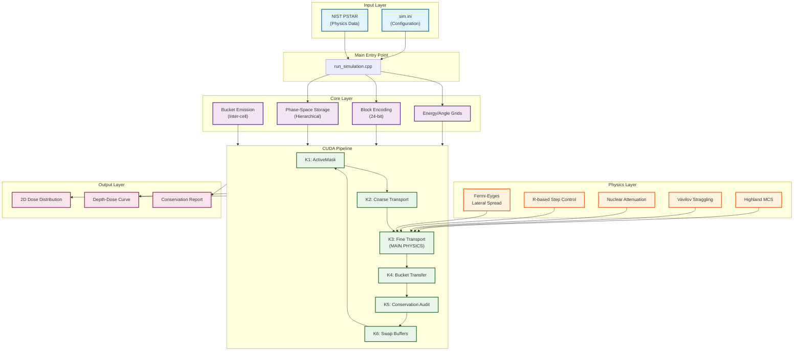
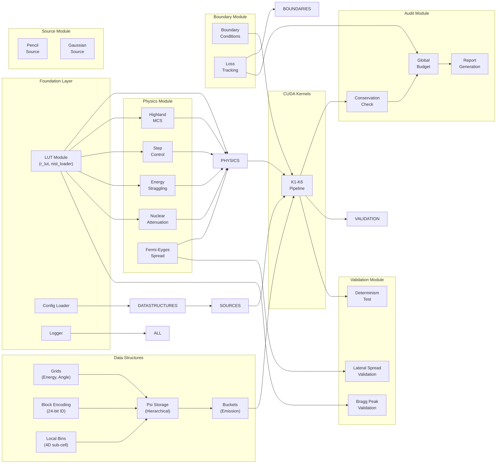
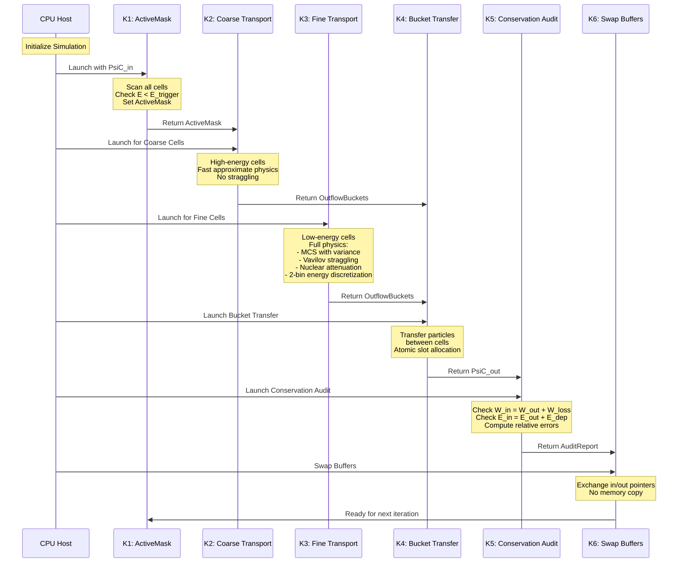
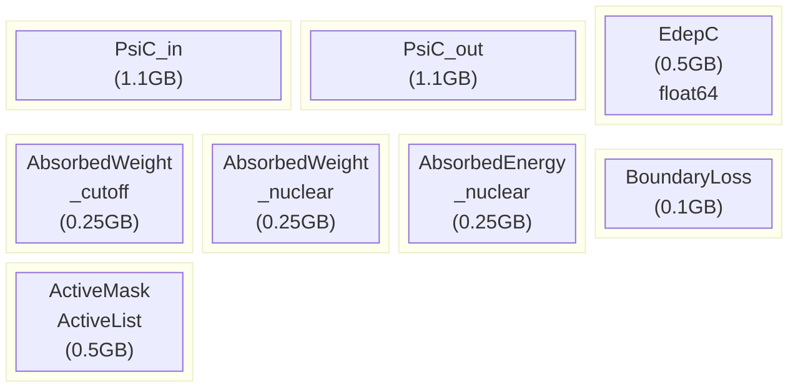
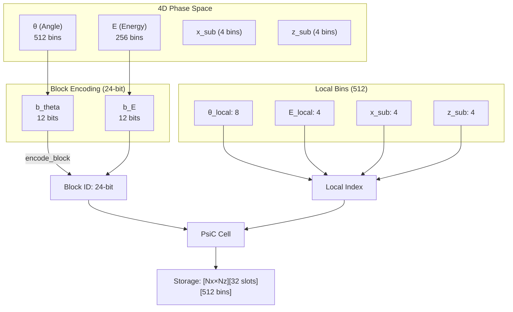
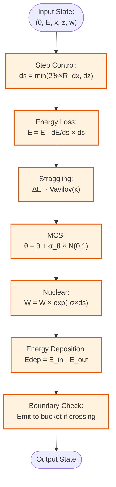

# SM_2D Architecture Overview

## Project Summary

**SM_2D** is a high-performance 2D deterministic transport solver for proton therapy dose calculation using CUDA-accelerated GPU computing. The project implements a hierarchical S-matrix solver with block-sparse phase-space representation.

### Key Statistics
- **Total Files**: 66 C++ source files, 9 CUDA kernels, 5 Python scripts
- **CUDA Kernels**: 9 files (K1-K6 pipeline + wrapper + support)
- **Lines of Code**: ~20,000 lines
- **Memory per Simulation**: ~4.3GB GPU memory
- **Grid Size**: Up to 200 × 640 cells
- **Test Files**: 31 test files (GoogleTest framework)

---

## System Architecture



---

## Module Dependency Graph



---

## CUDA Kernel Pipeline Detail



---

## Memory Layout



### Memory Breakdown

| Buffer | Size | Type | Purpose |
|--------|------|------|---------|
| `PsiC_in/out` | 1.1GB each | `float32` | Phase-space storage (hierarchical) |
| `EdepC` | 0.5GB | `float64` | Energy deposition grid |
| `AbsorbedWeight_cutoff` | 0.25GB | `float32` | Cutoff weight tracking |
| `AbsorbedWeight_nuclear` | 0.25GB | `float32` | Nuclear absorption tracking |
| `AbsorbedEnergy_nuclear` | 0.25GB | `float64` | Nuclear energy budget |
| `BoundaryLoss` | 0.1GB | `float32` | Boundary loss tracking |
| `ActiveMask/List` | 0.5GB | `uint8/uint32` | Active cell identification |

**Total**: ~4.3GB GPU memory

---

## Phase-Space Representation



### Encoding Details

**Block ID (24-bit):**
- Bits 0-11: `b_theta` (0-4095 angular bins)
- Bits 12-23: `b_E` (0-4095 energy bins)

**Local Index (16-bit):**
```cpp
idx = theta_local + 8 × (E_local + 4 × (x_sub + 4 × z_sub))
```

---

## Physics Pipeline per Step



---

## Directory Structure

```
SM_2D/
├── run_simulation.cpp          # Main entry point
├── sim.ini                     # Configuration file
├── visualize.py                # Python visualization
│
├── src/
│   ├── core/                   # Core data structures
│   │   ├── grids.cpp           # Energy/angle grids
│   │   ├── block_encoding.hpp  # 24-bit encoding
│   │   ├── local_bins.hpp      # 4D sub-cell partitioning
│   │   ├── psi_storage.cpp     # Hierarchical phase-space
│   │   └── buckets.cpp         # Bucket emission
│   │
│   ├── physics/                # Physics implementations
│   │   ├── highland.hpp        # Multiple Coulomb scattering
│   │   ├── energy_straggling.hpp  # Vavilov straggling
│   │   ├── nuclear.hpp         # Nuclear attenuation
│   │   ├── step_control.hpp    # R-based step control
│   │   └── fermi_eyges.hpp     # Lateral spread theory
│   │
│   ├── lut/                    # Lookup tables
│   │   ├── nist_loader.cpp     # NIST PSTAR data
│   │   └── r_lut.cpp           # Range-energy interpolation
│   │
│   ├── source/                 # Beam sources
│   │   ├── pencil_source.cpp   # Pencil beam
│   │   └── gaussian_source.cpp # Gaussian beam
│   │
│   ├── boundary/               # Boundary conditions
│   │   ├── boundaries.cpp      # Boundary types
│   │   └── loss_tracking.cpp   # Loss accounting
│   │
│   ├── audit/                  # Conservation auditing
│   │   ├── conservation.cpp    # Weight/energy checks
│   │   ├── global_budget.cpp   # Global aggregation
│   │   └── reporting.cpp       # Report generation
│   │
│   ├── validation/             # Validation tests
│   │   ├── bragg_peak.cpp      # Bragg peak analysis
│   │   ├── lateral_spread.cpp  # Lateral validation
│   │   ├── determinism.cpp     # Reproducibility tests
│   │   └── deterministic_beam.cpp  # Analytical reference
│   │
│   ├── utils/                  # Utilities
│   │   ├── logger.cpp          # Logging system
│   │   ├── memory_tracker.cpp  # GPU memory tracking
│   │   └── cuda_pool.cpp       # Memory pool
│   │
│   └── cuda/kernels/           # CUDA kernels
│       ├── k1_activemask.cu    # Active cell detection
│       ├── k2_coarsetransport.cu  # High-energy transport
│       ├── k3_finetransport.cu # Fine transport (main)
│       ├── k4_transfer.cu      # Bucket transfer
│       ├── k5_audit.cu         # Conservation audit
│       └── k6_swap.cu          # Buffer swap
│
├── src/include/                # Header files (mirror structure)
│   ├── core/
│   ├── physics/
│   ├── lut/
│   ├── source/
│   ├── boundary/
│   ├── audit/
│   ├── validation/
│   └── utils/
│
├── tests/                      # Unit tests
│   ├── unit/                   # Core tests
│   ├── kernels/                # Kernel tests
│   ├── physics/                # Physics validation
│   └── validation/             # Integration tests
│
└── docs/                       # Documentation
    ├── detailed/               # This documentation
    ├── SPEC.md                 # Project specification
    └── DEV_PLAN.md             # Development plan
```

---

## Key Design Principles

1. **Block-Sparse Storage**: Only allocate memory for active phase-space blocks
2. **Hierarchical Refinement**: Coarse transport for high-energy, fine transport for low-energy
3. **GPU-First Design**: All physics computation on GPU, minimal host-device transfer
4. **Conservation by Design**: Built-in auditing at every step
5. **Modular Physics**: Each physics process in separate header for easy validation

---

## References

- NIST PSTAR Database: https://physics.nist.gov/PhysRefData/Star/Text/PSTAR.html
- PDG 2024: https://pdg.lbl.gov/ (Highland formula)
- ICRU Report 73: Stopping powers for electrons and positrons
