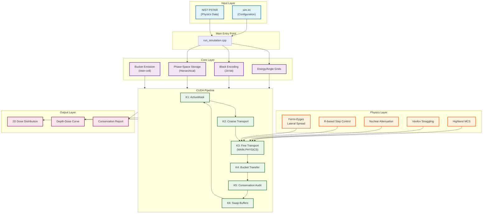
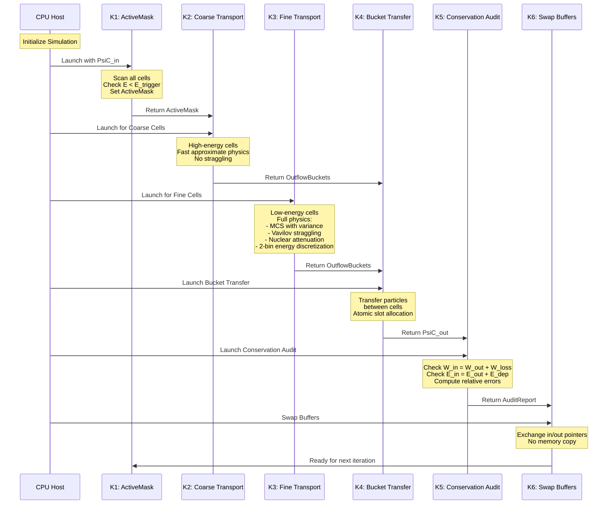
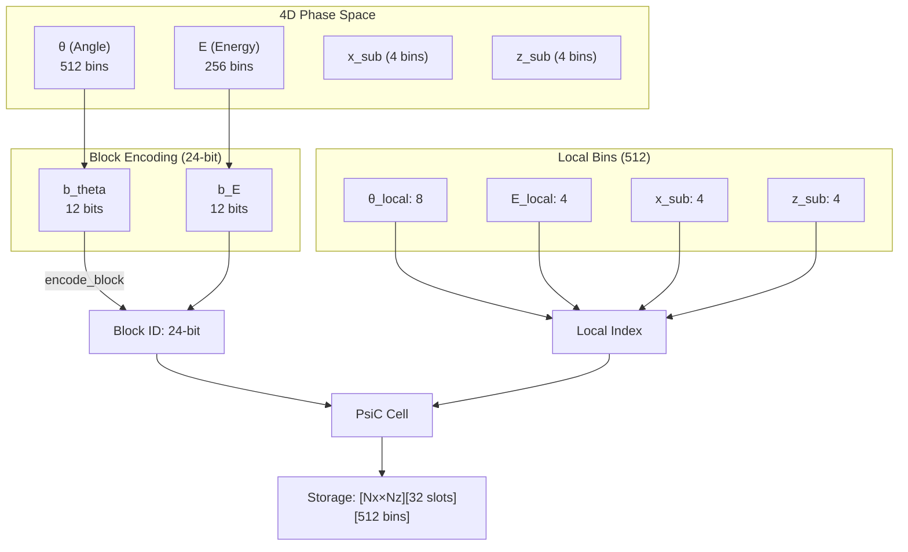
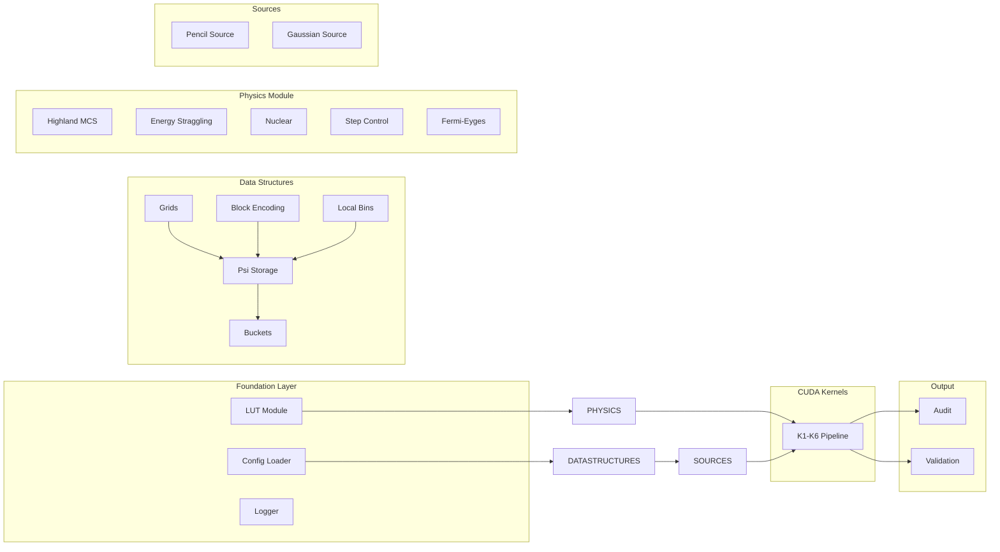
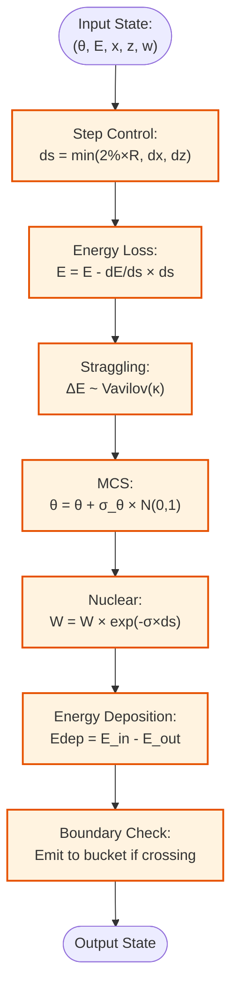
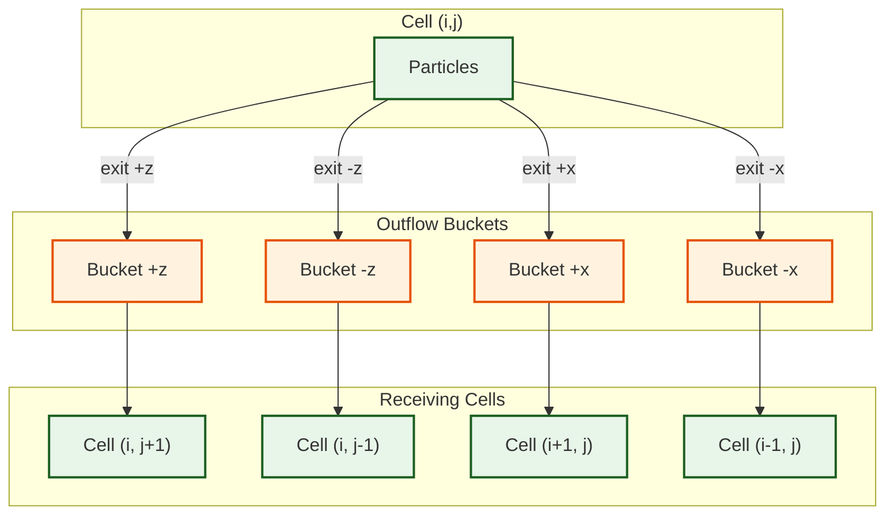
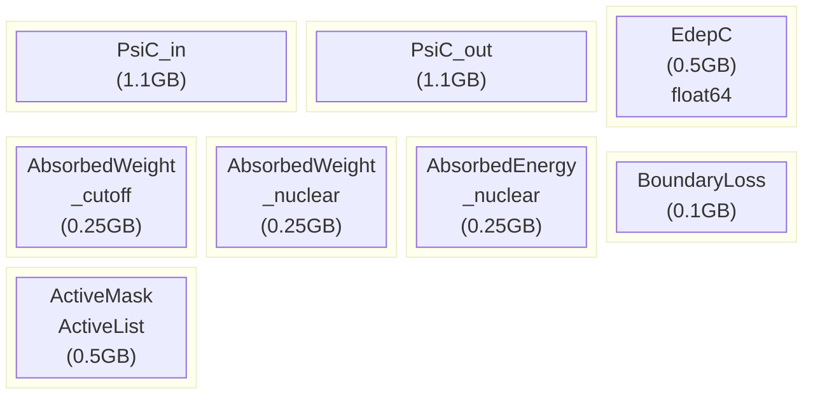
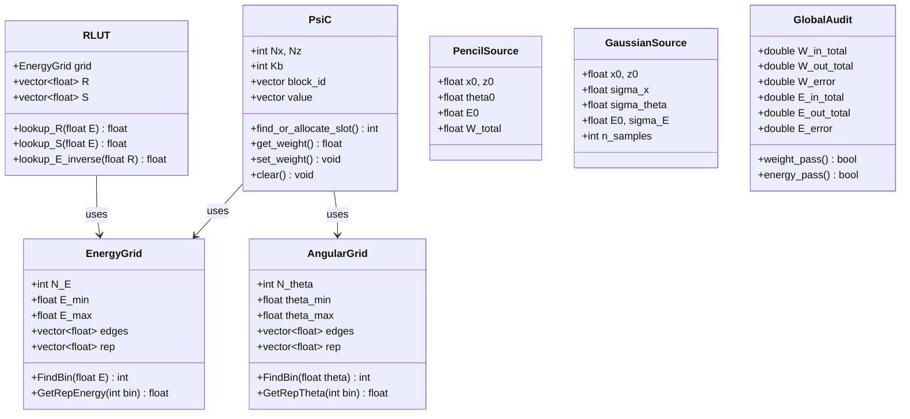
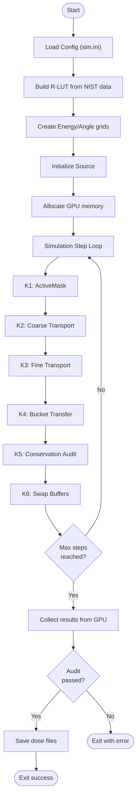
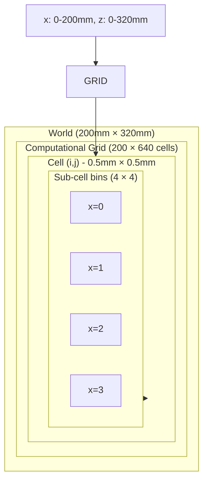

# SM_2D Visual Diagrams Collection

This document contains all Mermaid diagrams for visualizing the SM_2D system.

---

## 1. Complete System Architecture

---

## 2. CUDA Kernel Pipeline Sequence

---

## 3. Phase-Space Encoding

---

## 4. Module Dependency Graph

---

## 5. Physics Pipeline

---

## 6. Bucket Transfer Flow

---

## 7. Memory Layout

---

## 8. Class Hierarchy

---

## 9. Simulation Flow

---

## 10. Grid Structure

---

*Diagram Collection for SM_2D Documentation*
