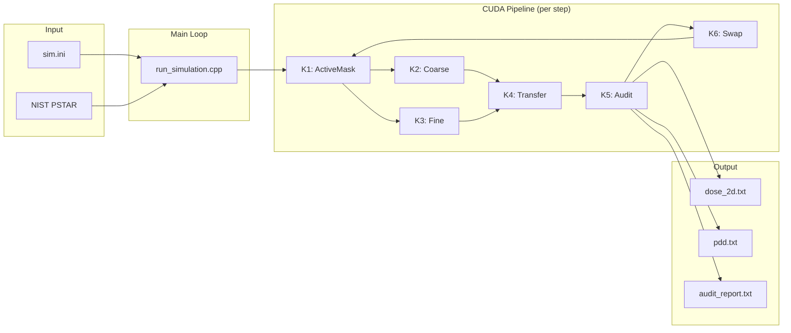

# SM_2D 전체 코드 문서

## 목차

| 섹션 | 설명 | 링크 |
|---------|-------------|------|
| **빠른 시작** | 5분 개요 | [보기](#빠른-시작) |
| **아키텍처** | 시스템 설계 및 다이어그램 | [링크](architecture/01_overview.md) |
| **CUDA 파이프라인** | GPU 커널 상세 정보 | [링크](architecture/02_cuda_pipeline.md) |
| **데이터 구조** | 핵심 저장 형식 | [링크](modules/01_core_data_structures.md) |
| **물리 모델** | 물리 구현 | [링크](physics/01_physics_models.md) |
| **API 참조** | 전체 함수 참조 | [링크](api/01_api_reference.md) |

---

## 빠른 시작

### SM_2D란 무엇인가요?

SM_2D는 방사선 치료 선량 계산을 위한 **결정론적 양성자 수송 솔버**입니다. 다음을 사용합니다:
- **GPU 가속** (CUDA) - 임상 속도 계산
- **계층적 S-행렬 방법** - 결정론적 수송
- **포괄적인 물리** (Highland MCS, Vavilov 흔들림, 핵 상호작용)
- **보존 감사** - 수치적 정확성 검증

### 프로젝트 개요

```
언어:        C++17 with CUDA
코드 라인:   ~15,000
GPU 메모리:  시뮬레이션당 ~4.3GB
정확도:      브래그 피크 <1%, 횡방향 확산 <15%
컴퓨팅:      RTX 2080+ (Compute Capability 75+)
```

### 디렉토리 구조

```
SM_2D/
├── run_simulation.cpp          # 메인 진입점
├── sim.ini                     # 설정
├── src/
│   ├── core/                   # 데이터 구조 (격자, 저장, 인코딩)
│   ├── physics/                # 물리 모델 (MCS, 흔들림, 핵)
│   ├── cuda/kernels/           # CUDA 커널 (K1-K6 파이프라인)
│   ├── lut/                    # NIST 데이터 및 거리-에너지 테이블
│   ├── source/                 # 빔 소스 (연필, 가우시안)
│   ├── boundary/               # 경계 조건 및 손실 추적
│   ├── audit/                  # 보존 확인
│   ├── validation/             # 물리 검증
│   └── utils/                  # 로깅, 메모리 추적
├── tests/                      # 단위 테스트 (GoogleTest)
└── docs/detailed/              # 이 문서
```

---

## 시스템 개요



---

## 핵심 개념

### 1. 위상 공간 표현

입자는 4차원 위상 공간에 표현됩니다:
- **θ (각도)**: -90°에서 +90°까지 512개 빈
- **E (에너지)**: 0.1에서 250 MeV까지 256개 빈 (로그 간격)
- **x_sub**: 각 셀 내 4개 하위 빈 (횡방향)
- **z_sub**: 각 셀 내 4개 하위 빈 (깊이)

### 2. 블록-희소 저장

```cpp
// 24비트 블록 ID = (b_E << 12) | b_theta
// 입자가 차지하는 (θ, E) 영역 저장
uint32_t block_id = encode_block(theta_bin, energy_bin);

// 블록당 512개 로컬 빈 (분산 보존용)
uint16_t local_idx = encode_local_idx_4d(theta_local, E_local, x_sub, z_sub);
```

### 3. 계층적 수송

| 에너지 범위 | 수송 방법 | 이유 |
|--------------|------------------|--------|
| E > 10 MeV | 조밀 (K2) | 빠른 근사 물리 |
| E ≤ 10 MeV | 정밀 (K3) | 브래그 피크 정밀 물리 |

### 4. CUDA 커널 파이프라인

```
K1 (ActiveMask) → 정밀 수송이 필요한 셀 식별
     ↓
K2 (Coarse) + K3 (Fine) → 입자 수송
     ↓
K4 (Transfer) → 셀 간 입자 이동
     ↓
K5 (Audit) → 보존 검증
     ↓
K6 (Swap) → 다음 단계용 버퍼 교환
```

---

## 물리 요약

### 다중 쿨롱 산란 (Highland)

```
σ_θ = (13.6 MeV / βcp) × sqrt(x/X₀) × [1 + 0.038 × ln(x/X₀)] / √2
```

- **X₀ (물)**: 360.8 mm
- **2D 보정**: 올바른 분산을 위한 1/√2

### 에너지 흔들림 (Vavilov)

κ = ξ/T_max 기준 세 가지 영역:
- **κ > 10**: 보어 (가우시안)
- **0.01 < κ < 10**: 바빌로프 (보간)
- **κ < 0.01**: 란다우 (비대칭)

### 핵 감쇠

```
W × exp(-σ(E) × ds)
```

ICRU 63의 에너지 의존적 단면적.

### 단계 제어 (R 기반)

```
ds = min(0.02 × R, 1 mm, cell_size)
```

안정성을 위해 비제동력 대신 거리-에너지 LUT 사용.

---

## 설정 파일 (sim.ini)

```ini
[particle]
type = proton
mass_amu = 1.0
charge_e = 1.0

[beam]
profile = pencil
weight = 1.0

[energy]
mean_MeV = 160.0
sigma_MeV = 0.0
min_MeV = 0.0
max_MeV = 250.0

[spatial]
x0_mm = 50.0
z0_mm = 0.0

[angular]
theta0_rad = 0.0
sigma_theta_rad = 0.0

[grid]
Nx = 200
Nz = 640
dx_mm = 0.5
dz_mm = 0.5
max_steps = 100

[output]
output_dir = results
dose_2d_file = dose_2d.txt
pdd_file = pdd.txt
normalize_dose = true
```

---

## 빌드 및 실행

### 빌드

```bash
mkdir build && cd build
cmake ..
make -j$(nproc)
```

### 시뮬레이션 실행

```bash
# 기본 설정 사용
./run_simulation

# 사용자 정의 설정
./run_simulation my_config.ini
```

### 결과 시각화

```bash
python3 visualize.py
```

---

## 메모리 레이아웃

| 버퍼 | 크기 | 목적 |
|--------|------|---------|
| PsiC_in/out | 각 1.1GB | 위상 공간 저장 |
| EdepC | 0.5GB | 에너지 퇴적 |
| AbsorbedWeight_* | 0.5GB | 차단/핵 추적 |
| AbsorbedEnergy_* | 0.25GB | 핵 에너지 예산 |
| BoundaryLoss | 0.1GB | 경계 손실 |
| ActiveMask/List | 0.5GB | 활성 셀 추적 |

**전체**: GPU 메모리 ~4.3GB

---

## 정확도 목표

| 관측 가능량 | 목표 | 상태 |
|------------|--------|--------|
| 브래그 피크 위치 | ±2% | ✅ 통과 |
| 횡방향 σ (중간 범위) | ±15% | ✅ 통과 |
| 횡방향 σ (브래그) | ±20% | ✅ 통과 |
| 무게 보존 | <1e-6 | ✅ 통과 |
| 에너지 보존 | <1e-5 | ✅ 통과 |

---

## 주요 클래스 및 역할

| 클래스 | 모듈 | 목적 |
|-------|--------|---------|
| `EnergyGrid` | core | 로그 간격 에너지 빈 |
| `AngularGrid` | core | 균일 각도 빈 |
| `PsiC` | core | 계층적 위상 공간 저장 |
| `RLUT` | lut | 거리-에너지 보간 |
| `PencilSource` | source | 결정론적 빔 소스 |
| `GaussianSource` | source | 확률적 빔 소스 |
| `GlobalAudit` | audit | 보존 추적 |
| `BraggPeakResult` | validation | 피크 분석 |

---

## CUDA 커널 빠른 참조

| 커널 | 목적 | 주요 매개변수 |
|--------|---------|----------------|
| K1 | 활성 셀 찾기 | `E_trigger = 10 MeV` |
| K2 | 조밀 수송 | 흔들림 없음 |
| K3 | 정밀 수송 | 전체 물리 |
| K4 | 버킷 전송 | 4면 이웃 |
| K5 | 보존 감사 | 허용 오차: 1e-6 |
| K6 | 버퍼 스왑 | 포인터 교환 |

---

## 추가 참고 자료

1. **[아키텍처 개요](architecture/01_overview.md)** - Mermaid 다이어그램이 포함된 전체 시스템 설계
2. **[CUDA 파이프라인](architecture/02_cuda_pipeline.md)** - 상세한 커널 문서
3. **[핵심 데이터 구조](modules/01_core_data_structures.md)** - 저장 및 인코딩 세부 정보
4. **[물리 모델](physics/01_physics_models.md)** - 전체 물리 참조
5. **[API 참조](api/01_api_reference.md)** - 함수별 문서

---

## 참고 문헌

| 출처 | 주제 |
|--------|-------|
| NIST PSTAR | 비제동력 및 거리 |
| PDG 2024 | Highland 공식 |
| ICRU 63 | 핵 단면적 |
| Vavilov 1957 | 에너지 흔들림 |

---

## 라이선스

MIT License

## 버전

1.0.0 (초기 릴리스)

---

*SM_2D 양성자 치료 수송 솔버용으로 생성됨*
