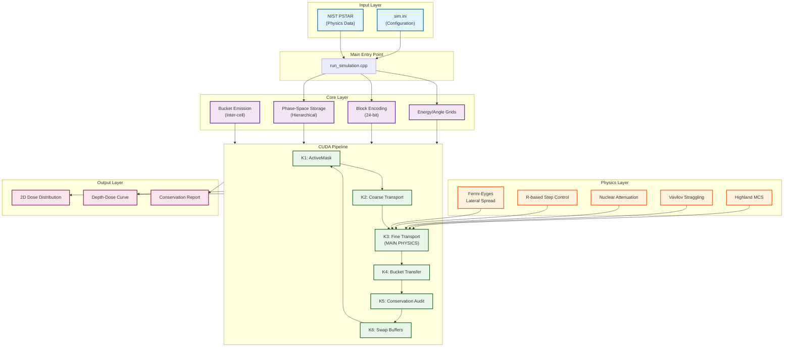
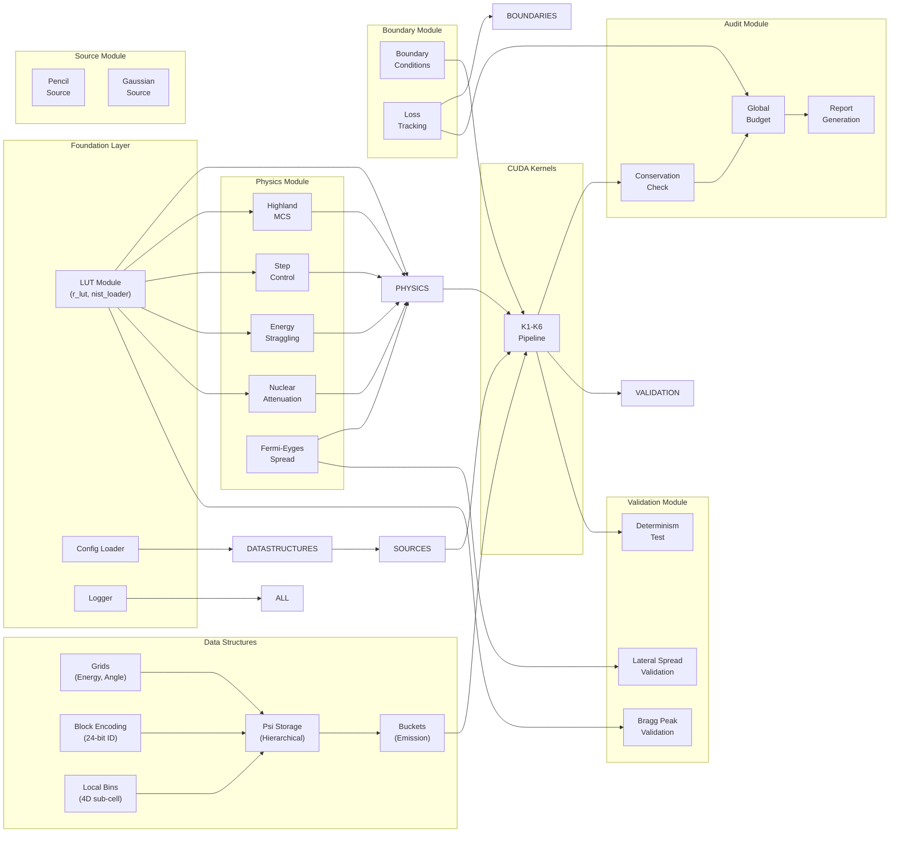
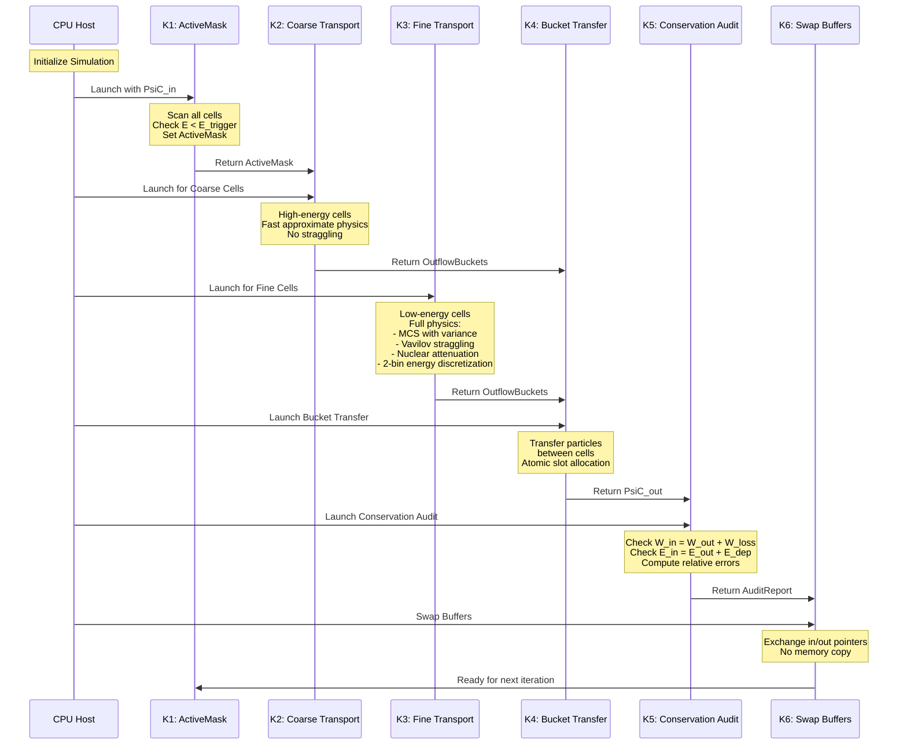
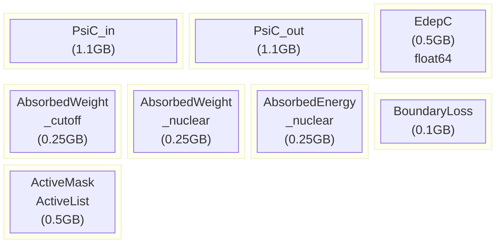
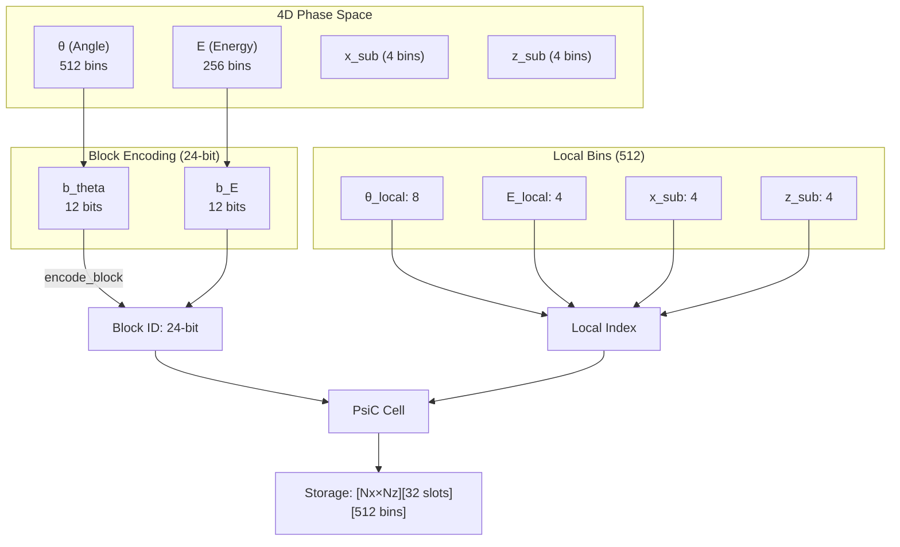
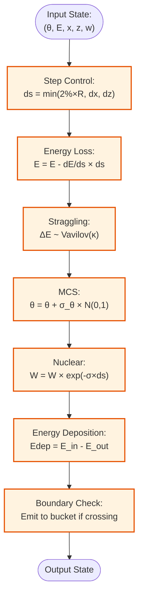

# SM_2D 아키텍처 개요 (Architecture Overview)

## 프로젝트 요약 (Project Summary)

**SM_2D**는 CUDA 가속 GPU 컴퓨팅을 사용하는 양성자 치료 선량 계산을 위한 고성능 2D 결정론적 전송 솔버입니다. 이 프로젝트는 블록-희소 위상 공간 표현을 사용하는 계층적 S-매트릭스 솔버를 구현합니다.

### 주요 통계 (Key Statistics)
- **전체 파일**: 30개 이상의 C++ 소스 파일
- **CUDA 커널**: 6개 주요 커널 (K1-K6)
- **코드 라인**: 약 15,000 라인
- **시뮬레이션당 메모리**: 약 3GB GPU 메모리
- **그리드 크기**: 최대 200 × 640 셀

---

## 시스템 아키텍처 (System Architecture)



---

## 모듈 의존성 그래프 (Module Dependency Graph)



---

## CUDA 커널 파이프라인 상세 (CUDA Kernel Pipeline Detail)



---

## 메모리 레이아웃 (Memory Layout)



### 메모리 분석 (Memory Breakdown)

| 버퍼 (Buffer) | 크기 (Size) | 타입 (Type) | 용도 (Purpose) |
|--------|------|------|---------|
| `PsiC_in/out` | 각 1.1GB | `float32` | 위상 공간 저장 (계층적) |
| `EdepC` | 0.5GB | `float64` | 에너지 퇴적 그리드 |
| `AbsorbedWeight_cutoff` | 0.25GB | `float32` | 컷오프 가중치 추적 |
| `AbsorbedWeight_nuclear` | 0.25GB | `float32` | 핵 흡수 추적 |
| `AbsorbedEnergy_nuclear` | 0.25GB | `float64` | 핵 에너지 예산 |
| `BoundaryLoss` | 0.1GB | `float32` | 경계 손실 추적 |
| `ActiveMask/List` | 0.5GB | `uint8/uint32` | 활성 셀 식별 |

**전체**: 약 4.3GB GPU 메모리

---

## 위상 공간 표현 (Phase-Space Representation)



### 인코딩 상세 (Encoding Details)

**블록 ID (24-bit):**
- 비트 0-11: `b_theta` (0-4095 각도 빈)
- 비트 12-23: `b_E` (0-4095 에너지 빈)

**로컬 인덱스 (16-bit):**
```cpp
idx = theta_local + 8 × (E_local + 4 × (x_sub + 4 × z_sub))
```

---

## 스텝별 물리 파이프라인 (Physics Pipeline per Step)



---

## 디렉토리 구조 (Directory Structure)

```
SM_2D/
├── run_simulation.cpp          # 메인 진입점 (Main entry point)
├── sim.ini                     # 설정 파일 (Configuration file)
├── visualize.py                # Python 시각화 (Python visualization)
│
├── src/
│   ├── core/                   # 핵심 데이터 구조 (Core data structures)
│   │   ├── grids.cpp           # 에너지/각도 그리드 (Energy/angle grids)
│   │   ├── block_encoding.hpp  # 24-bit 인코딩 (24-bit encoding)
│   │   ├── local_bins.hpp      # 4D 서브셀 분할 (4D sub-cell partitioning)
│   │   ├── psi_storage.cpp     # 계층적 위상 공간 (Hierarchical phase-space)
│   │   └── buckets.cpp         # 버킷 방출 (Bucket emission)
│   │
│   ├── physics/                # 물리 구현 (Physics implementations)
│   │   ├── highland.hpp        # 다중 쿨롱 산란 (Multiple Coulomb scattering)
│   │   ├── energy_straggling.hpp  # 바빌로프 스트래글링 (Vavilov straggling)
│   │   ├── nuclear.hpp         # 핵 감쇠 (Nuclear attenuation)
│   │   ├── step_control.hpp    # R 기반 스텝 제어 (R-based step control)
│   │   └── fermi_eyges.hpp     # 횡방향 확산 이론 (Lateral spread theory)
│   │
│   ├── lut/                    # 룩업 테이블 (Lookup tables)
│   │   ├── nist_loader.cpp     # NIST PSTAR 데이터 (NIST PSTAR data)
│   │   └── r_lut.cpp           # 거리-에너지 보간 (Range-energy interpolation)
│   │
│   ├── source/                 # 빔 소스 (Beam sources)
│   │   ├── pencil_source.cpp   # 펜슬 빔 (Pencil beam)
│   │   └── gaussian_source.cpp # 가우시안 빔 (Gaussian beam)
│   │
│   ├── boundary/               # 경계 조건 (Boundary conditions)
│   │   ├── boundaries.cpp      # 경계 타입 (Boundary types)
│   │   └── loss_tracking.cpp   # 손실 회계 (Loss accounting)
│   │
│   ├── audit/                  # 보존 감사 (Conservation auditing)
│   │   ├── conservation.cpp    # 가중치/에너지 검사 (Weight/energy checks)
│   │   ├── global_budget.cpp   # 전체 집계 (Global aggregation)
│   │   └── reporting.cpp       # 보고서 생성 (Report generation)
│   │
│   ├── validation/             # 검증 테스트 (Validation tests)
│   │   ├── bragg_peak.cpp      # 브래그 피크 분석 (Bragg peak analysis)
│   │   ├── lateral_spread.cpp  # 횡방향 검증 (Lateral validation)
│   │   ├── determinism.cpp     # 재현성 테스트 (Reproducibility tests)
│   │   └── deterministic_beam.cpp  # 해석적 참조 (Analytical reference)
│   │
│   ├── utils/                  # 유틸리티 (Utilities)
│   │   ├── logger.cpp          # 로깅 시스템 (Logging system)
│   │   ├── memory_tracker.cpp  # GPU 메모리 추적 (GPU memory tracking)
│   │   └── cuda_pool.cpp       # 메모리 풀 (Memory pool)
│   │
│   └── cuda/kernels/           # CUDA 커널 (CUDA kernels)
│       ├── k1_activemask.cu    # 활성 셀 감지 (Active cell detection)
│       ├── k2_coarsetransport.cu  # 고에너지 전송 (High-energy transport)
│       ├── k3_finetransport.cu # 정밀 전송 (Fine transport, main)
│       ├── k4_transfer.cu      # 버킷 전송 (Bucket transfer)
│       ├── k5_audit.cu         # 보존 감사 (Conservation audit)
│       └── k6_swap.cu          # 버퍼 스왑 (Buffer swap)
│
├── src/include/                # 헤더 파일 (Header files, mirror structure)
│   ├── core/
│   ├── physics/
│   ├── lut/
│   ├── source/
│   ├── boundary/
│   ├── audit/
│   ├── validation/
│   └── utils/
│
├── tests/                      # 단위 테스트 (Unit tests)
│   ├── unit/                   # 코어 테스트 (Core tests)
│   ├── kernels/                # 커널 테스트 (Kernel tests)
│   ├── physics/                # 물리 검증 (Physics validation)
│   └── validation/             # 통합 테스트 (Integration tests)
│
└── docs/                       # 문서 (Documentation)
    ├── detailed/               # 이 문서 (This documentation)
    ├── SPEC.md                 # 프로젝트 명세서 (Project specification)
    └── DEV_PLAN.md             # 개발 계획 (Development plan)
```

---

## 핵심 설계 원칙 (Key Design Principles)

1. **블록-희소 저장 (Block-Sparse Storage)**: 활성 위상 공간 블록에만 메모리 할당
2. **계층적 세분화 (Hierarchical Refinement)**: 고에너지용 거친 전송, 저에너지용 정밀 전송
3. **GPU 우선 설계 (GPU-First Design)**: 모든 물리 계산은 GPU에서, 최소의 호스트-디바이스 전송
4. **설계에 의한 보존 (Conservation by Design)**: 모든 단계에서 내장된 감사
5. **모듈식 물리 (Modular Physics)**: 각 물리 프로세스는 검증을 위해 별도 헤더에 구현

---

## 참고문헌 (References)

- NIST PSTAR Database: https://physics.nist.gov/PhysRefData/Star/Text/PSTAR.html
- PDG 2024: https://pdg.lbl.gov/ (Highland formula)
- ICRU Report 73: Stopping powers for electrons and positrons
