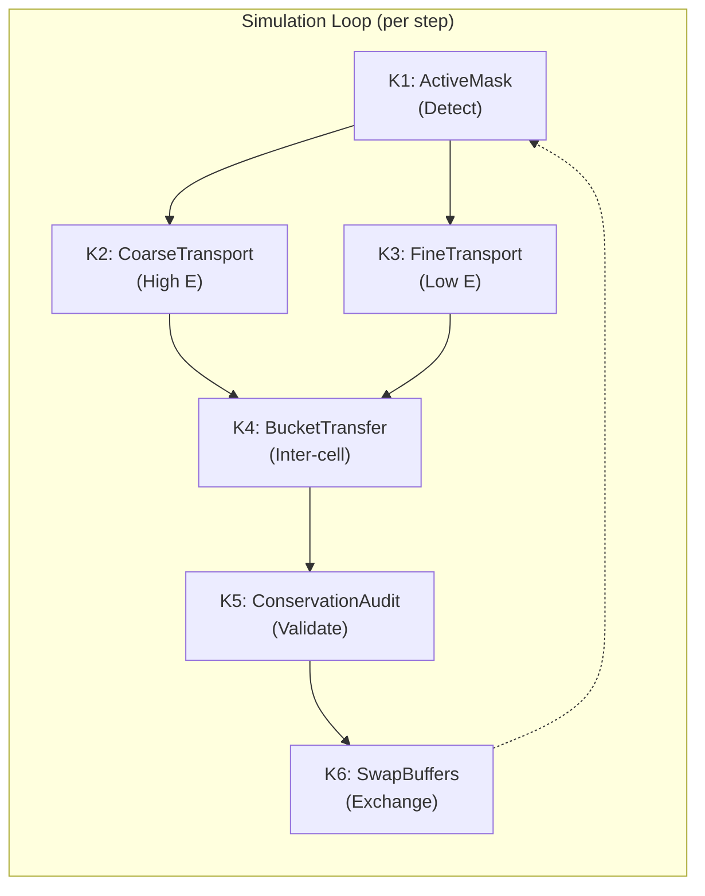

# 커널 파이프라인 문서

## 개요 (Overview)

SM_2D는 결정론적 양성자 수송을 위한 6단계 CUDA 커널 파이프라인을 구현합니다. 파이프라인은 계층적 정제(hierarchical refinement)를 통해 입자를 처리하며, 고에너지 입자에는 거친 수송(coarse transport)을, 중요한 브래그 피크 영역에는 정밀 수송(fine transport)을 적용합니다.

---

## 파이프라인 아키텍처 (Pipeline Architecture)



---

## K1: ActiveMask 커널

### 파일: `src/cuda/kernels/k1_activemask.cu`

### 목적 (Purpose)
정밀 수송이 필요한 셀 식별 (브래그 피크 영역의 저에너지 입자).

### 함수 시그니처 (Signature)

```cpp
__global__ void k1_activemask(
    // Input phase-space
    const uint32_t* __restrict__ block_ids_in,
    const float* __restrict__ values_in,

    // Grid parameters
    const int Nx, const int Nz,

    // Thresholds
    const float b_E_trigger,      // Energy threshold (default: 10 MeV)
    const float weight_active_min, // Minimum weight (default: 1e-12)

    // Output
    uint8_t* __restrict__ ActiveMask
);
```

### 알고리즘 (Algorithm)

```cpp
__global__ void k1_activemask(...) {
    int cell = blockIdx.x * blockDim.x + threadIdx.x;
    if (cell >= Nx * Nz) return;

    float total_weight = 0.0f;
    bool has_low_energy = false;

    // Sum weight across all slots and local bins
    for (int slot = 0; slot < Kb; ++slot) {
        uint32_t bid = block_ids_in[cell * Kb + slot];
        if (bid == EMPTY_BLOCK_ID) continue;

        // Decode block ID
        uint32_t b_theta, b_E;
        decode_block(bid, b_theta, b_E);

        // Get representative energy
        float E = get_rep_energy(b_E);

        // Check if low energy
        if (E < b_E_trigger) {
            has_low_energy = true;
        }

        // Accumulate weight
        for (int i = 0; i < LOCAL_BINS; ++i) {
            total_weight += values_in[flat_index(cell, slot, i)];
        }
    }

    // Set mask if low energy AND sufficient weight
    ActiveMask[cell] = (has_low_energy && total_weight > weight_active_min) ? 1 : 0;
}
```

### 스레드 구성 (Thread Configuration)

| 매개변수 (Parameter) | 값 (Value) |
|-----------|-------|
| Grid Size | `(Nx * Nz + 255) / 256` |
| Block Size | 256 threads |
| Memory Access | Coalesced reads from `block_ids_in`, `values_in` |

---

## K2: Coarse Transport 커널

### 파일: `src/cuda/kernels/k2_coarsetransport.cu`

### 목적 (Purpose)
고에너지 입자를 위한 빠른 근사 수송 (ActiveMask = 0).

### K3와의 주요 차이점 (Key Differences from K3)

| 기능 (Feature) | K2 (Coarse) | K3 (Fine) |
|---------|-------------|-----------|
| Energy straggling | No (mean only) | Yes (Vavilov) |
| MCS sampling | No (variance only) | Yes (random sampling) |
| Step size | Larger | Smaller |
| Accuracy | ~5% | <1% |

### 함수 시그니처 (Signature)

```cpp
__global__ void k2_coarsetransport(
    // Input phase-space (coarse cells only)
    const uint32_t* __restrict__ block_ids_in,
    const float* __restrict__ values_in,
    const uint8_t* __restrict__ ActiveMask,

    // Grid & physics
    const int Nx, const int Nz, const float dx, const float dz,
    const RLUT __restrict__ lut,

    // Output
    uint32_t* __restrict__ block_ids_out,
    float* __restrict__ values_out,
    double* __restrict__ EdepC,
    float* __restrict__ AbsorbedWeight_cutoff,
    float* __restrict__ AbsorbedWeight_nuclear,
    double* __restrict__ AbsorbedEnergy_nuclear,
    OutflowBucket* __restrict__ OutflowBuckets
);
```

### 간소화된 물리 (Simplified Physics)

```cpp
__device__ void coarse_transport_step(
    float& E, float& theta, float& x, float& z, float& w,
    float ds, const RLUT& lut
) {
    // Energy loss (mean only, no straggling)
    float E_new = lut.lookup_E_inverse(lut.lookup_R(E) - ds);

    // MCS: accumulate variance but don't sample
    float sigma_theta = highland_sigma(E, ds, X0_water);
    theta_variance += sigma_theta * sigma_theta;  // Just track

    // Nuclear attenuation (same as fine)
    float sigma_nuc = Sigma_total(E);
    w *= exp(-sigma_nuc * ds);

    // Position update
    x += ds * sin(theta);
    z += ds * cos(theta);

    E = E_new;
}
```

---

## K3: Fine Transport 커널 (주요 물리, MAIN PHYSICS)

### 파일: `src/cuda/kernels/k3_finetransport.cu`

### 목적 (Purpose)
저에너지 입자를 위한 고정밀 몬테카를로 수송 (브래그 피크 영역).

### 함수 시그니처 (Signature)

```cpp
__global__ void k3_finetransport(
    // Input: Active cell list
    const int* __restrict__ ActiveList,
    const int n_active,

    // Input phase-space
    const uint32_t* __restrict__ block_ids_in,
    const float* __restrict__ values_in,

    // Grid & physics
    const int Nx, const int Nz, const float dx, const float dz,
    const RLUT __restrict__ lut,
    const curandStateMRG32k3a* __restrict__ rng_states,

    // Output
    uint32_t* __restrict__ block_ids_out,
    float* __restrict__ values_out,
    double* __restrict__ EdepC,
    float* __restrict__ AbsorbedWeight_cutoff,
    float* __restrict__ AbsorbedWeight_nuclear,
    double* __restrict__ AbsorbedEnergy_nuclear,
    OutflowBucket* __restrict__ OutflowBuckets
);
```

### 알고리즘 (셀당, Per Cell)

```cpp
__global__ void k3_finetransport(...) {
    int idx = blockIdx.x * blockDim.x + threadIdx.x;
    if (idx >= n_active) return;

    int cell = ActiveList[idx];
    curandStateMRG32k3a local_rng = rng_states[idx];

    // Process each slot in the cell
    for (int slot = 0; slot < Kb; ++slot) {
        uint32_t bid = block_ids_in[cell * Kb + slot];
        if (bid == EMPTY_BLOCK_ID) continue;

        // Decode block
        uint32_t b_theta, b_E;
        decode_block(bid, b_theta, b_E);

        // Process each local bin
        for (int lidx = 0; lidx < LOCAL_BINS; ++lidx) {
            float w = values_in[flat_index(cell, slot, lidx)];
            if (w < weight_epsilon) continue;

            // Decode 4D phase-space coordinates
            int theta_local, E_local, x_sub, z_sub;
            decode_local_idx(lidx, theta_local, E_local, x_sub, z_sub);

            float theta = get_theta_from_bins(b_theta, theta_local);
            float E = get_energy_from_bins(b_E, E_local);
            float x = cell_x + get_x_offset_from_bin(x_sub, dx);
            float z = cell_z + get_z_offset_from_bin(z_sub, dz);

            // --- MAIN PHYSICS LOOP ---
            float cell_Edep = 0.0;
            float cell_E_nuc = 0.0;
            float w_cutoff = 0.0;

            while (true) {
                // Step size control
                float ds = compute_max_step_physics(E, lut);
                ds = fminf(ds, compute_boundary_step(x, z, dx, dz, theta));

                // Energy loss with straggling
                float dE_straggle = sample_energy_loss_with_straggling(E, ds, &local_rng);
                float E_new = lut.lookup_E_inverse(lut.lookup_R(E) - ds) + dE_straggle;
                E_new = fmaxf(E_new, E_cutoff);

                // Energy deposition
                float dE = E - E_new;
                cell_Edep += w * dE;

                // MCS with sampling
                float sigma_theta = highland_sigma(E, ds, X0_water);
                float dtheta = sample_mcs_angle(sigma_theta, &local_rng);
                theta += dtheta;

                // Nuclear attenuation
                float sigma_nuc = Sigma_total(E);
                float w_nuc = w * (1.0f - exp(-sigma_nuc * ds));
                w -= w_nuc;
                cell_E_nuc += w_nuc * E;

                // Position update
                x += ds * sin(theta);
                z += ds * cos(theta);

                E = E_new;

                // Check for boundary exit
                int face = check_boundary_exit(x, z, dx, dz);
                if (face >= 0) {
                    // Emit to bucket
                    emit_to_bucket(OutflowBuckets, cell, face,
                                  theta, E, x, z, w);
                    break;
                }

                // Check cutoff
                if (E < E_cutoff) {
                    w_cutoff += w;
                    break;
                }

                // Check if still in same cell
                int new_cell = get_cell(x, z, dx, dz);
                if (new_cell != cell) {
                    // Transfer to bucket
                    int face = get_exit_face(x, z, dx, dz);
                    emit_to_bucket(OutflowBuckets, cell, face,
                                  theta, E, x, z, w);
                    break;
                }
            }

            // Accumulate outputs
            atomicAdd(&EdepC[cell], cell_Edep);
            atomicAdd(&AbsorbedWeight_cutoff[cell], w_cutoff);
            atomicAdd(&AbsorbedWeight_nuclear[cell], w - w_cutoff);
            atomicAdd(&AbsorbedEnergy_nuclear[cell], cell_E_nuc);
        }
    }

    rng_states[idx] = local_rng;
}
```

### 빈 내 샘플링 (Intra-Bin Sampling)

분산 보존을 위해 입자는 빈 내에서 균일하게 샘플링됩니다:

```cpp
__device__ void sample_intra_bin(
    float& theta, float& E,
    int theta_local, int E_local,
    curandStateMRG32k3a* rng
) {
    // Sample uniform offset within bin
    float u_theta = curand_uniform(rng) - 0.5f;  // [-0.5, 0.5]
    float u_E = curand_uniform(rng) - 0.5f;

    // Add to representative values
    theta += u_theta * dtheta_bin;
    E *= pow(10.0f, u_E * dlogE_bin);  // Log spacing for E
}
```

---

## K4: Bucket Transfer 커널

### 파일: `src/cuda/kernels/k4_transfer.cu`

### 목적 (Purpose)
유출 버킷에서 인접 셀로 입자 가중치 전송.

### 함수 시그니처 (Signature)

```cpp
__global__ void k4_transfer(
    // Input: Outflow buckets from all cells
    const OutflowBucket* __restrict__ OutflowBuckets,

    // Grid
    const int Nx, const int Nz,

    // Output phase-space
    uint32_t* __restrict__ block_ids_out,
    float* __restrict__ values_out
);
```

### 알고리즘 (Algorithm)

```cpp
__global__ void k4_transfer(...) {
    int cell = blockIdx.x * blockDim.x + threadIdx.x;
    if (cell >= Nx * Nz) return;

    // Get cell coordinates
    int ix = cell % Nx;
    int iz = cell / Nx;

    // Receive from 4 neighbors
    int neighbors[4] = {
        iz + 1 < Nz ? cell + Nx : -1,  // +z
        iz - 1 >= 0 ? cell - Nx : -1,  // -z
        ix + 1 < Nx ? cell + 1 : -1,   // +x
        ix - 1 >= 0 ? cell - 1 : -1    // -x
    };

    // Process each neighbor's bucket
    for (int face = 0; face < 4; ++face) {
        int src_cell = neighbors[face];
        if (src_cell < 0) continue;  // Boundary

        const OutflowBucket& bucket = OutflowBuckets[src_cell * 4 + face];

        // Transfer each entry in bucket
        for (int k = 0; k < Kb_out; ++k) {
            uint32_t bid = bucket.block_id[k];
            if (bid == EMPTY_BLOCK_ID) continue;

            // Find or allocate slot
            int slot = find_or_allocate_slot(block_ids_out, cell, bid);
            if (slot < 0) continue;  // No space

            // Add weights
            for (int lidx = 0; lidx < LOCAL_BINS; ++lidx) {
                float w = bucket.value[k][lidx];
                if (w > 0) {
                    atomicAdd(&values_out[flat_index(cell, slot, lidx)], w);
                }
            }
        }
    }
}
```

### 원자적 슬롯 할당 (Atomic Slot Allocation)

```cpp
__device__ int find_or_allocate_slot(
    uint32_t* block_ids,
    int cell,
    uint32_t bid
) {
    // First pass: check if exists
    for (int slot = 0; slot < Kb; ++slot) {
        if (block_ids[cell * Kb + slot] == bid) {
            return slot;
        }
    }

    // Second pass: allocate empty slot
    for (int slot = 0; slot < Kb; ++slot) {
        uint32_t expected = EMPTY_BLOCK_ID;
        uint32_t* ptr = &block_ids[cell * Kb + slot];
        if (atomicCAS(ptr, expected, bid) == expected) {
            return slot;  // Successfully allocated
        }
    }

    return -1;  // No space available
}
```

---

## K5: Conservation Audit 커널

### 파일: `src/cuda/kernels/k5_audit.cu`

### 목적 (Purpose)
셀당 가중치 및 에너지 보존 검증.

### 함수 시그니처 (Signature)

```cpp
__global__ void k5_audit(
    // Input phase-space (both in and out)
    const uint32_t* __restrict__ block_ids_in,
    const float* __restrict__ values_in,
    const uint32_t* __restrict__ block_ids_out,
    const float* __restrict__ values_out,

    // Absorption arrays
    const float* __restrict__ AbsorbedWeight_cutoff,
    const float* __restrict__ AbsorbedWeight_nuclear,
    const double* __restrict__ AbsorbedEnergy_nuclear,

    // Grid
    const int Nx, const int Nz,

    // Output report
    AuditReport* __restrict__ reports
);
```

### 알고리즘 (Algorithm)

```cpp
__global__ void k5_audit(...) {
    int cell = blockIdx.x * blockDim.x + threadIdx.x;
    if (cell >= Nx * Nz) return;

    // Sum input weight
    float W_in = 0.0f;
    for (int slot = 0; slot < Kb; ++slot) {
        if (block_ids_in[cell * Kb + slot] != EMPTY_BLOCK_ID) {
            for (int i = 0; i < LOCAL_BINS; ++i) {
                W_in += values_in[flat_index(cell, slot, i)];
            }
        }
    }

    // Sum output weight
    float W_out = 0.0f;
    for (int slot = 0; slot < Kb; ++slot) {
        if (block_ids_out[cell * Kb + slot] != EMPTY_BLOCK_ID) {
            for (int i = 0; i < LOCAL_BINS; ++i) {
                W_out += values_out[flat_index(cell, slot, i)];
            }
        }
    }

    // Get absorption
    float W_cut = AbsorbedWeight_cutoff[cell];
    float W_nuc = AbsorbedWeight_nuclear[cell];

    // Check conservation
    float W_expected = W_out + W_cut + W_nuc;
    float W_diff = fabsf(W_in - W_expected);
    float W_rel = W_diff / fmaxf(W_in, 1e-20f);

    // Store report
    reports[cell].W_in = W_in;
    reports[cell].W_out = W_out;
    reports[cell].W_error = W_rel;
    reports[cell].pass = (W_rel < 1e-6f);
}
```

---

## K6: Swap Buffers 커널

### 파일: `src/cuda/kernels/k6_swap.cu`

### 목적 (Purpose)
다음 반복을 위한 입력/출력 버퍼 교환 (CPU 측 포인터 스왑).

### 구현 (Implementation)

```cpp
// Host-side function (no kernel launch)
void k6_swap_buffers(
    uint32_t*& block_ids_in,
    uint32_t*& block_ids_out,
    float*& values_in,
    float*& values_out
) {
    // Three-way XOR swap (no temporary needed)
    swap(block_ids_in, block_ids_out);
    swap(values_in, values_out);
}
```

### 커널이 없는 이유? (Why No Kernel?)

포인터 스왑은 CPU 연산입니다 - GPU 메모리를 수정할 필요가 없습니다.
이로써 반복당 약 2.2GB의 메모리 복사를 피할 수 있습니다.

---

## 메모리 접근 패턴 (Memory Access Patterns)

### Coalesced Access 전략 (Coalesced Access Strategy)

```
Global Memory Layout:
┌─────────────────────────────────────────┐
│ Cell 0: Slot 0, Bins 0-511              │ → Thread 0-255
│ Cell 0: Slot 1, Bins 0-511              │
│ ...                                     │
└─────────────────────────────────────────┘

Thread 0 reads:  block_ids_in[0],   values_in[0:31]
Thread 1 reads:  block_ids_in[1],   values_in[32:63]
...
Thread 255 reads: block_ids_in[255], values_in[8160:8191]
```

### 공유 메모리 사용 (Shared Memory Usage)

| 커널 (Kernel) | 공유 메모리 (Shared Memory) | 목적 (Purpose) |
|--------|---------------|---------|
| K1 | 256B | Partial reduction for weight sum |
| K3 | 4KB | Local bin accumulation |
| K4 | 1KB | Bucket transfer buffer |

---

## 성능 최적화 요약 (Performance Optimization Summary)

| 기법 (Technique) | 커널 (Kernel(s)) | 이점 (Benefit) |
|-----------|-----------|---------|
| Active cell processing | K2, K3 | Skip empty cells (60-90% savings) |
| Coarse/fine split | K2, K3 | 3-5x speedup for high-energy |
| Atomic operations | K4 | Thread-safe slot allocation |
| Intra-bin sampling | K3 | Variance preservation |
| Pointer swap | K6 | Avoid 2.2GB memory copy |
| Coalesced access | All | Max memory bandwidth |

---

## 실행 구성 예제 (Launch Configuration Example)

```cpp
// Grid dimensions
dim3 grid( (Nx * Nz + 255) / 256 );
dim3 block(256);

// K1: ActiveMask
k1_activemask<<<grid, block>>>(...);

// K3: Fine transport (smaller grid for active cells)
dim3 grid_fine( (n_active + 255) / 256 );
k3_finetransport<<<grid_fine, block>>>(...);

// Synchronization
cudaDeviceSynchronize();
```
